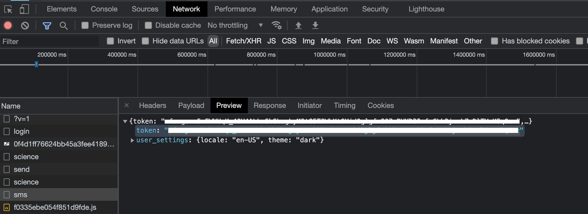
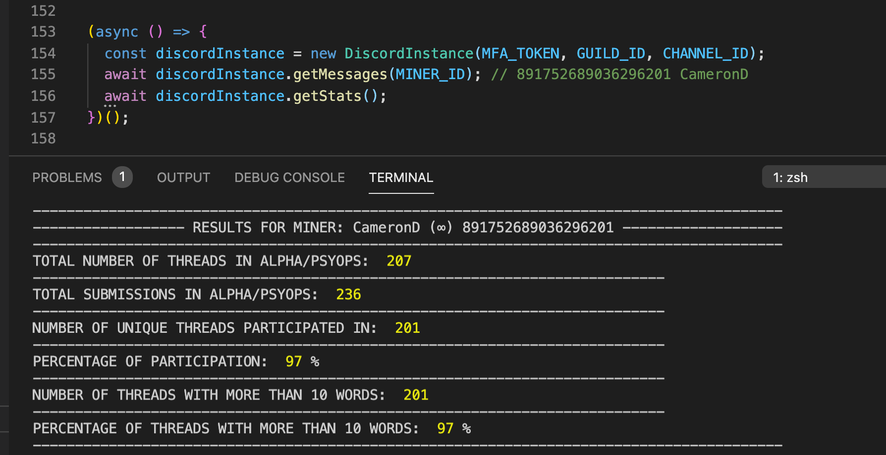

# get-channel-participation-stats

## Repo to look up a user and check their participation in alpha/psyops channel.

### REQUIREMENTS

- [NodeJS](https://nodejs.org/en/download/) Version >= 14
- `MFA_TOKEN` FROM THE NETWORK TAB AFTER AUTHENTICATING INTO DISCORD FROM THE BROWSER - CONTACT Ncrypted#2381 FOR MORE INFO. 
- `GUILD_ID` - THE ID OF THE SERVER, CONCAVE'S IS `910961041003913216`
- `CHANNEL_ID` - ALPHA/PYSOPS CHANNEL ID IS `914614393218682891`
- `MINER_ID` - THE ID OF THE MINER THAT YOU WANT TO SEARCH THE HISTORY FOR

### DISCLAIMERS

- PLEASE SAVE THE FILE `getMessages.js` AFTER CHANGING THE `MINER_ID` EVERY TIME AND LOOK FOR THE MINER NAME IN THE RESULTS TO CONFIRM THAT YOU ARE GETTING RESULTS FOR THE INTENDED USER.
- THIS SCRIPT EMULATES A BROWSER LOGIN AND A SEARCH BAR LOOKUP FROM YOUR OWN ACCOUNT
- THIS SCRIPT GETS 25 MESSAGES EVERY 2 SECONDS TO AVOID HITTING THE RATE LIMIT FOR DISCORD
- THIS SRIPT WILL ONLY WORK FOR ALPHA/PSYOPS CHANNEL CURRENTLY
- AN MFA TOKEN IS REQUIRED IF MFA IS ENABLED, OTHERWISE REGULAR AUTH TOKEN WILL WORK
- THERE IS NO DB CONNECTED TO THIS SCRIPT, NO DATA IS BEING PERSISTED.
- USE THIS SCRIPT AT YOUR OWN DISCRETION. THIS SCRIPT IS FOR EDUCATIONAL PURPOSES ONLY.

### INSTRUCTIONS

- `npm install` to install the dependency for making API calls
- replace the variables at the top of the script in the file `getMessages.js`
- To run the script run: `npm run fetch`

### SAMPLE RESULTS

CONTACT Ncrypted#2381 FOR MORE INFO OR QUESTIONS
